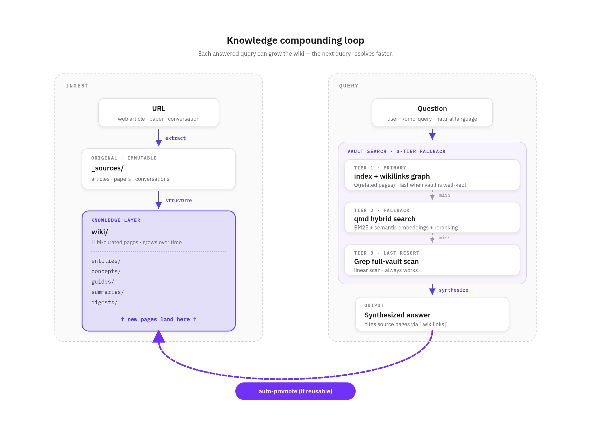

# oh-my-obsidian (OMO)

[English](README.md) · **한국어**

[](https://opensource.org/licenses/MIT)
[](https://claude.com/claude-code)
[](https://nodejs.org)
[](https://github.com/JunHyeongLee92/oh-my-obsidian/issues)

**Turn any Obsidian vault into an LLM-maintained wiki.**

[Andrej Karpathy의 LLM wiki 컨셉](https://gist.github.com/karpathy/442a6bf555914893e9891c11519de94f) 구현체.  
3계층 구조: 불변 원본(`_sources/`), LLM이 관리하는 wiki, 규약을 정의하는 schema.

> [!NOTE]
> **LLM wiki 컨셉 (Karpathy)이란?**
> 기존 RAG는 질문할 때마다 원본을 다시 읽는다 — 모델은 배운 것을 **축적하지 못한다**.  
> LLM wiki는 이를 뒤집는다: LLM이 구조화되고 상호 링크된 지식 베이스를 직접 유지한다.  
> 새 원본은 분류·요약·링크되고, 재사용 가능한 답은 새 페이지로 승격된다. 지식이 매 턴 재발견되는 게 아니라 시간이 지날수록 **복리로 쌓인다**.

Claude Code 플러그인. Claude가 볼트의 자율 큐레이터로 상주하며, 별도 프롬프트 없이:

- URL을 저장하고 원본·요약·엔티티·개념 페이지로 교차 링크
- 볼트에 질문하면 답하고, 재사용 가치 있으면 새 페이지로 승격
- 프로젝트 커밋 시 오래된 위키 항목을 자동 경고

슬래시 명령(`/omo-ingest ...`)과 자연어("이 URL 위키에 추가해줘") 모두 지원.


> 여러 git 프로젝트가 하나의 볼트를 공유하는 허브 구조. 상세는 [Plugin concepts](docs/concepts.ko.md) 참고.

## 지식이 누적되는 방식

OMO는 **답을 위키 페이지로 고정**시켜 같은 발견을 반복하지 않는다. 검색 자체가 위키를 성장시킨다.



- **`/omo-ingest <URL>`** — 원본은 `_sources/`에 불변 저장 + LLM이 엔티티·개념·요약 페이지로 구조화해 `wiki/`에 기록
- **`/omo-query <질문>`** — 3-tier 검색 후 답 합성
  1. `wiki/index.md` + `[[wikilinks]]` 그래프 순회
  2. (못 찾으면) `qmd` 하이브리드 검색 (BM25 + semantic)
  3. (그래도 못 찾으면) `Grep` 전체 스캔
  - 재사용 가치 있으면 **답을 새 wiki 페이지로 자동 승격** → 다음에 같은 질문은 Tier 1에서 즉시 해결
- **결과**: 위키가 커질수록 Tier 1 hit rate 상승, Tier 2/3 호출 감소. 쿼리 자체가 위키를 성장시킴.

## Why OMO?

볼트를 혼자 관리하면 쌓이기만 하고 안 쓰게 된다. OMO는 Claude가 볼트를 **자율적으로 유지**하게 만든다.

| 기존 워크플로                       | OMO                                                                           |
| ----------------------------------- | ----------------------------------------------------------------------------- |
| URL 북마크 후 잊어버림              | `/omo-ingest` → 원본 저장 + 엔티티·개념·요약 자동 생성·교차 링크              |
| "이거 전에 조사했는데..." 검색 실패 | `/omo-query` → 볼트 답변, 재사용 가치 있으면 새 페이지로 자동 승격            |
| 프로젝트마다 같은 자료 재조사       | `/omo-project-add` → 프로젝트 CLAUDE.md가 볼트 참조, 커밋 시 오래된 위키 경고 |
| 노트 쌓이면 구조 붕괴               | 스키마 + 일일 lint로 6개월 뒤에도 탐색 가능                                   |
| 새 주제 학습 시 매번 처음부터       | `/omo-study` → 볼트 맥락 기반 단계별 학습 (단계마다 객관식 확인)              |

## Install

**Linux / macOS** (Windows는 WSL2). Claude Code + Node.js 20+ 필요.

```bash
/plugin marketplace add https://github.com/JunHyeongLee92/oh-my-obsidian
/plugin install oh-my-obsidian
/reload-plugins
/omo-init ~/my-vault
```

## Try it

```bash
/omo-ingest https://www.anthropic.com/news/claude-4-7
/omo-query "Claude 4.7이 이전 버전과 뭐가 다른가"
/omo-study "prompt caching"
```

자연어도 된다: "이 URL 위키에 추가해줘 https://...".

## Skills

| Skill                  | 역할                                                                                                 |
| ---------------------- | ---------------------------------------------------------------------------------------------------- |
| `/omo-init`            | 볼트 초기화 + cron 등록                                                                              |
| `/omo-ingest`          | URL을 볼트에 수집 (원본 + 요약·엔티티·개념)                                                          |
| `/omo-query`           | 볼트 검색 + 재사용 가치 있으면 자동 승격                                                             |
| `/omo-project-add`     | 현재 git 프로젝트를 볼트에 연결                                                                      |
| `/omo-project-analyze` | repo 분석해 `docs/architecture.md`·`docs/usage.md` 생성 — 세션 간 재사용 가능                        |
| `/omo-project-update`  | `wiki-staleness-check` 경고 원샷 해결 — 현재 상태 재작성 + `updated` 갱신 + 필요 시 worklog·ADR 초안 |
| `/omo-study`           | 볼트 맥락 기반 단계별 학습 (단계마다 객관식)                                                         |
| `/omo-lint`            | 스키마·링크 점검, 승인 후 CRITICAL 자동 수정                                                         |
| `/omo-digest`          | 주간 재가공 (cron 자동 + 수동 호출 가능)                                                             |
| `/omo-uninstall`       | OMO cron 제거 + 선택적 config 삭제                                                                   |

## Docs

- [Plugin concepts](docs/concepts.ko.md) — 아키텍처 · 검색 · 볼트 구조 · cron 스케줄
- [Troubleshooting](docs/troubleshooting.ko.md) — 설치·cron·lint·ingest 문제 해결
- [Git backup](docs/git-sync.ko.md) — 볼트 원격 자동 동기화
- [Contributing](CONTRIBUTING.md) · [Changelog](CHANGELOG.md) · [Issues](https://github.com/JunHyeongLee92/oh-my-obsidian/issues)

## Acknowledgments

[Claude Code](https://claude.com/claude-code) · [Obsidian](https://obsidian.md) · [Playwright](https://playwright.dev) · [Defuddle](https://github.com/kepano/defuddle)

## License

[MIT](LICENSE)
