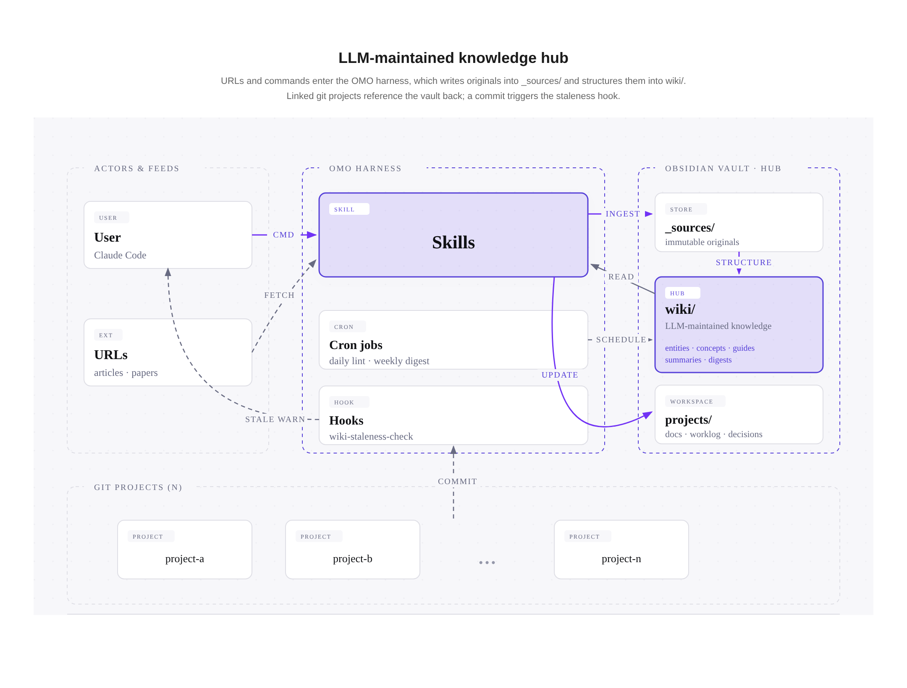

# Plugin concepts

[English](concepts.md) · **한국어**

OMO 플러그인이 내부적으로 어떻게 동작하는지 — 아키텍처, 검색 경로, 볼트 구조.

## Background

OMO는 Andrej Karpathy가 [LLM wiki gist](https://gist.github.com/karpathy/442a6bf555914893e9891c11519de94f)에서 제안한 패턴의 구현이다. 쿼리마다 원본 문서에서 지식을 재발견하는 기존 RAG 대신, LLM이 마크다운 wiki를 유지하면서 ingest 시 한 번 합성하고 이후엔 구조화된 업데이트로 최신 상태를 유지한다. 이를 뒷받침하는 3계층:

- **`_sources/`** — 원본 자료 (아티클·논문·대화). Ingest 시 한 번 기록되고 이후 불변.
- **`wiki/`** — LLM이 관리하는 지식 계층. 타입 있는 페이지(entity / concept / guide / summary / digest) + 스키마 검증 frontmatter + cross-link. 에이전트가 원본을 다시 읽지 않고 그래프만 순회해도 답할 수 있도록 설계.
- **`schema/`** — LLM에게 "페이지를 어떻게 만들어야 하는지" 알려주는 규약 문서 (`page-types.md`, `frontmatter-spec.md`, `lint-rules.md` 등).

Wiki는 "누적되는 artifact" — ingest마다 cross-reference가 늘고, digest가 도메인 간 패턴을 드러내며, 재사용 가치 있는 답변은 새 페이지로 승격되어 다음 세션에서 재발견하지 않도록 만든다.

## Architecture

여러 git 프로젝트를 **하나의 Obsidian 볼트**에 연결해 중앙 지식 허브로 쓰는 구조. 플러그인(하네스)이 사용자 명령·자동화·훅을 오케스트레이션하고, 사용자는 볼트를 직접 관리하지 않는다.



**읽는 법**:

- **보라색 focal** — Skills(오케스트레이션 진입점)와 wiki/(지식 허브). 시스템의 두 중심.
- **실선** — 사용자 명령, 내부 읽기/쓰기 등 능동 동작
- **점선** — 자동 이벤트 (URL fetch, cron 스케줄, commit 트리거, staleness 경고)
- 프로젝트 N개가 **하나의 볼트**를 공유. 각 프로젝트는 `projects/<name>/`(wiki와 동등 레벨의 최상위 폴더)에 자신의 스크래치패드를 가지며, 프로젝트 `CLAUDE.md`가 볼트를 역참조한다.

설계 원칙 상세는 [CONTRIBUTING.md § Architecture](../CONTRIBUTING.md#architecture) 참조.

## Search behavior

`/omo-query`는 3단 폴백 구조:

1. **위키 구조 기반** (주 경로) — `wiki/index.md` 카테고리 색인에서 후보 페이지 선별 → 직접 read → `[[wikilinks]]` 3-depth 전이
2. **`qmd` 하이브리드 검색** (폴백) — Tier 1로 답 합성 불가 시 `qmd query` 호출. BM25(키워드) + 시맨틱(임베딩) + 재순위 조합
3. **Grep 전수 스캔** (최후) — `qmd` 미설치 환경의 백업

위키 구조(index + wikilinks)가 잘 관리되면 Tier 1에서 끝나고 `qmd`는 호출되지 않는다. Cron이 매일 03:15에 `qmd` 인덱스를 미리 갱신해둔다.

**인덱스 두 종류 구분**:

| 인덱스              | 매체                            | 갱신 시점                    | 용도                |
| ------------------- | ------------------------------- | ---------------------------- | ------------------- |
| `wiki/index.md`     | 사람이 읽는 마크다운 + 위키링크 | 쓰기 스킬 호출마다 **즉시**  | 주 탐색 (Tier 1)    |
| `qmd` 하이브리드    | 외부 BM25 + 시맨틱 임베딩       | Cron 하루 1회 (03:15)        | 폴백 검색 (Tier 2)  |

## Vault layout

```
~/my-vault/
├── wiki/                    # LLM이 유지하는 지식 (_sources/에서 파생)
│   ├── index.md             #   카테고리 색인 (03:15 daily refresh)
│   ├── log.md               #   append-only 변경 이력
│   ├── entities/            #   사람·도구·서비스·제품·조직
│   ├── concepts/            #   패턴·방법론·기술 아이디어
│   ├── guides/              #   How-to 가이드
│   ├── summaries/           #   소스 1건당 요약 1건 (ingest 산출물)
│   └── digests/             #   주간 재가공 (월요일 03:30)
├── projects/                # 사용자·LLM 협업 작업 공간 (연결된 repo 별)
│   └── <name>/
│       ├── index.md         #   1페이지 허브 — 현재 상태 at-a-glance
│       ├── docs/            #   정적 이해 (architecture.md, usage.md)
│       ├── worklog/         #   시간 축 기록 (YYYY-MM-DD.md)
│       └── decisions/       #   ADR (dec-NNN-*.md)
├── _sources/                # 외부 원본 (immutable)
│   └── articles/ papers/ conversations/ assets/ misc/
├── _ops/
│   ├── lint-reports/        #   lint 출력 (머신별 latest-<hostname>.md만 git 추적)
│   └── templates/           #   Obsidian Templater 10종 (수동 페이지 생성)
├── .obsidian/               # Obsidian 설정 (templates 연결 완료)
├── README.md                # 볼트 사용 가이드 (자동 생성)
└── .gitignore
```

## Cron schedule

`/omo-init`이 자동 등록하는 작업 (OMO-CRON 태그 — `omo-uninstall`이 인식):

- **매일 03:00** — `lint.sh` (스키마 위반 검출, 리포트만 생성)
- **매일 03:15** — `qmd-update.sh` (위키 검색 폴백용 `qmd` 하이브리드 인덱스 갱신)
- **월요일 03:30** — `weekly-digest.sh` (Claude CLI로 주간 재가공)

`git-sync`는 자동 등록하지 않는다 — 새 볼트는 원격·SSH 인증이 보통 설정돼 있지 않아 sync가 실패만 반복하기 때문. 원격을 붙인 뒤 수동 등록은 [git-sync.ko.md](git-sync.ko.md) 참조.
