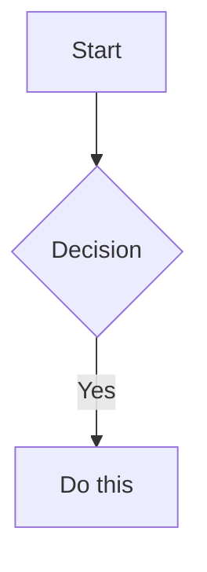

# Obsidian Syntax

Every wiki page in this vault must render correctly in Obsidian's Reading View. An LLM should be able to use the right Obsidian-specific syntax by reading this document alone, without any other skill.

## Guiding principles

- **Use only when needed.** Overusing callouts, highlights, and block IDs kills readability.
- **Wikilinks for internal links, markdown links for external URLs.** Use `[[...]]` for pages inside the vault and `[text](url)` for the web.
- **Do not invent custom callout types.** Stick to the default types in the table below.
- **CommonMark/GFM standard syntax** (headings, lists, tables, code, blockquotes, …) is assumed. This document only covers Obsidian's extensions.

## Frontmatter

See `frontmatter-spec.md` for the schema. This document covers syntax only.

```yaml
---
type: guide
created: 2026-04-17
updated: 2026-04-17
status: active
tags: [wiki, setup]
aliases: [alias-1, alias-2]
---
```

`tags` / `aliases` are arrays. Both flow (`[a, b]`) and block (`- a\n- b`) notations are allowed.

## Wikilinks (internal links)

```markdown
[[page-name]]                     link to page
[[page-name|display text]]        custom display
[[page-name#heading]]             to a specific heading
[[page-name#^block-id]]           to a specific block
[[#heading in this doc]]          heading in the same doc
[[projects/vibevoice/index|vibevoice]]  subpath (project page)
```

**Project-page links include the path**: `[[vibevoice/index|vibevoice]]` (the file is `index.md`, so a display name is required).

**Escape pipes inside tables**: the alias delimiter `|` collides with the table column separator and breaks rendering. Write it as `[[vibevoice/index\|vibevoice]]` with `\|`, or drop the alias (`[[llm-wiki]]`). When you need consecutive rows with a blank first column, use a continuation marker like `⤷` instead of a truly empty cell (`| |`) so the column count stays explicit.

## Embeds

Prefix a wikilink with `!` to render the target inline in the current page.

```markdown
![[page-name]]                    embed the full page
![[page-name#heading]]            embed a specific section
![[image.png]]                    image
![[image.png|300]]                image with width
![[document.pdf#page=3]]          specific PDF page
```

**Use for**: reusing shared warning copy, attaching images, referencing a Mermaid block from a project page elsewhere.

## Callouts

```markdown
> [!note]
> Default callout.

> [!warning] Custom title
> A title is optional.

> [!faq]- Collapsed
> Fold/unfold: `-` = collapsed, `+` = expanded.
```

### Default types and usage

| Type                | Usage                                              |
|---------------------|----------------------------------------------------|
| `note`              | General reference                                  |
| `tip`               | Useful tips, shortcuts, quick wins                 |
| `info`              | Background context                                 |
| `warning`           | Caveats, pitfalls, failure cases                   |
| `danger` / `bug`    | Serious risks                                      |
| `success`           | Chosen option, successful outcome                  |
| `failure`           | Rejected alternative, failed attempt               |
| `example`           | Concrete example                                   |
| `quote`             | Verbatim quotation                                 |
| `abstract`          | Definition, overview                               |
| `question` / `faq`  | Question                                           |
| `todo`              | Item to do                                         |

### Anti-patterns

- Don't wrap every section in a callout. Reserve callouts for paragraphs that carry special meaning.
- Keep to ~3–5 callouts per page max.

## Block references

```markdown
This paragraph can be referenced. ^my-block-id

> Quotation

^quote-id
```

From another page: `[[this-page#^my-block-id]]`.

**When to use**: assign IDs only to paragraphs that are actually referenced — e.g. the "decision" paragraph in a decision record, or a preservation-worthy quote in a summary. Don't tag every paragraph.

## Highlight

```markdown
==key phrase==
```

Keep to three or fewer per page. Use only on words that should jump out during scanning or search.

## Tags

- Frontmatter `tags:` is the default. Use inline `#tag` only when emphasis truly matters.
- Nesting is allowed: `#project/active`.
- Tags may be camelCase or kebab-case, but stay consistent within the vault.

## Task list (checkboxes)

```markdown
- [ ] pending
- [x] done
- [ ] parent item
  - [ ] nested allowed
```

**Primary use**: worklog plan/done items.

## Math

```markdown
Inline: $O(n \log n)$

Block:
$$
\frac{a}{b} = c
$$
```

## Mermaid

Style rules live in `mermaid-style.md`. Syntax only:

````markdown

````

To link a Mermaid node to an Obsidian page: add `class NodeName internal-link;`.

## Comments (hidden)

```markdown
This line is visible %%this part is hidden%% continues.

%%
Multi-line hidden.
%%
```

Invisible in Reading View and Graph View. Good for drafts or internal notes.

## Footnotes

```markdown
Body text[^1] with a footnote.

[^1]: Footnote content.

Inline footnote.^[inline form.]
```

## Recommended syntax per page type

For detailed section structure see `page-types.md`. The table below maps only the syntax.

| Page type     | Recommended Obsidian syntax                                                                                                                              |
|---------------|----------------------------------------------------------------------------------------------------------------------------------------------------------|
| **project**   | `> [!info]` callout for current state; list of connected pages as wikilinks                                                                              |
| **worklog**   | `- [ ]` / `- [x]` required for plan/done items; commit hashes as inline code                                                                             |
| **decision**  | Context in `> [!info]`; decision paragraph carries a `^dec-id` block ID; chosen option in `> [!success]`; rejected alternatives in `> [!failure]`; comparison table |
| **jira**      | Ticket link as a markdown link (`[PIAXT-NNN](url)`); related worklog as wikilinks                                                                        |
| **entity**    | Key identifiers in `==text==`; relations as a "relation-type — [[link]]" list                                                                            |
| **concept**   | Definition in `> [!abstract]`; core terms in `==text==`; related concepts as a wikilink list                                                             |
| **guide**     | Procedure as a numbered list; troubleshooting in `> [!warning]`; tips/shortcuts in `> [!tip]`; prerequisites in `> [!info]`                              |
| **summary**   | Preservation-worthy quotes in `> [!quote]` + `^quote-id`; extracted entities/concepts as wikilink lists                                                  |
| **digest**    | Cross-cutting insights in `> [!info]`; this-week's changes as a wikilink list                                                                            |

## Checklist — review after writing a page

- [ ] Does the frontmatter follow the schema in `frontmatter-spec.md`?
- [ ] Are all entities/concepts mentioned in the body linked as `[[wikilinks]]`?
- [ ] Do external URLs use `[text](url)` (not wikilink)?
- [ ] Are callout types from the default list above?
- [ ] Are block IDs attached only to paragraphs that are actually referenced?
- [ ] Are highlights (`==text==`) three or fewer?
- [ ] Does the page follow the recommended syntax for its type?
